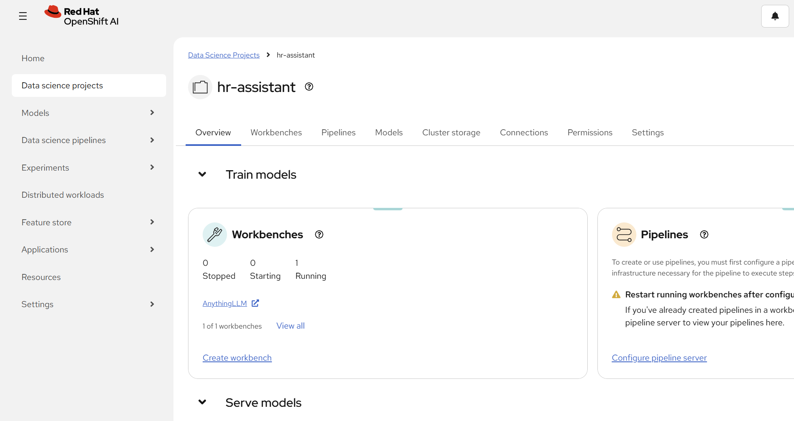
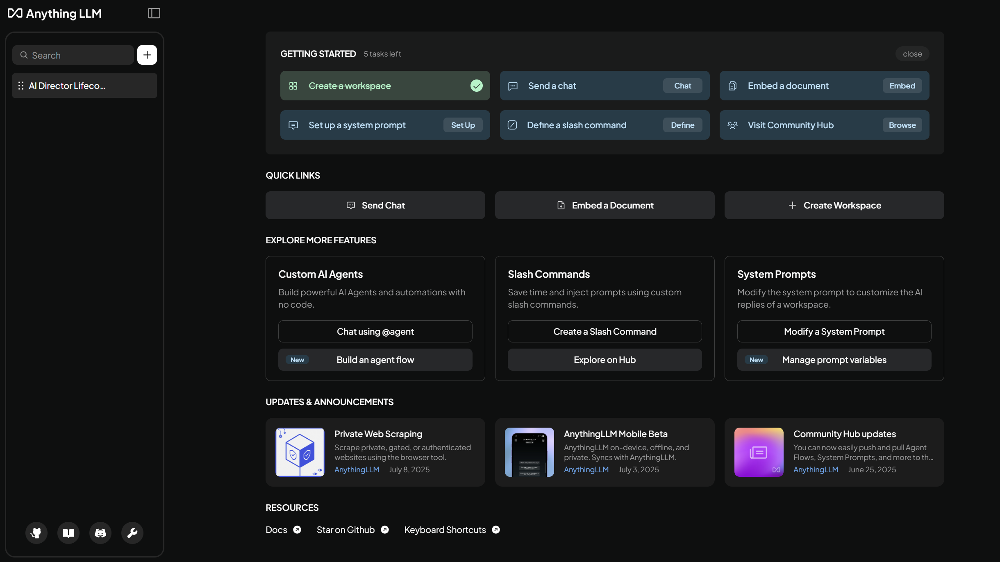
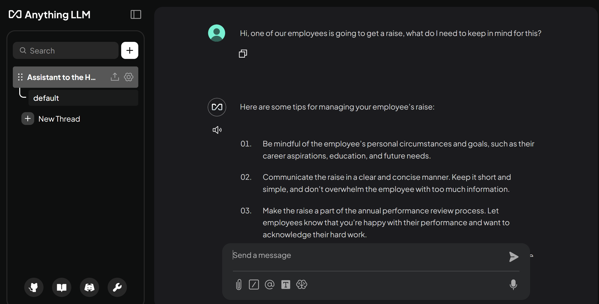

# AI Leadership & Strategy Lifecoach

Streamlined chat interface guiding AI executives on strategy, team building,
ethics, governance, and leadership in a rapidly evolving AI landscape. 

## Detailed description 

The *AI Leadership & Strategy Lifecoach* is a lightweight quickstart designed to
give AI leaders a trusted sounding board for key decisions. Chat with this
lifecoach for quick, strategic insights and actionable advice. 

This quickstart was designed for environments where GPUs are not available or
necessary, making it ideal for lightweight inference use cases, prototyping, or
constrained environments. By making the most of vLLM on CPU-based
infrastructure, this AI lifecoach can be deployed to almost any OpenShift AI
environment. 

This quickstart includes a Helm chart for deploying:

- An OpenShift AI Project.
- vLLM with CPU support running an instance of TinyLlama.
- AnythingLLM, a versatile chat interface, running as a workbench and connected
  to the vLLM.
  
Use this project to quickly spin up a minimal vLLM instance and start serving
models like TinyLlama on CPU—no GPU required. 🚀


<!-- ### See it in action -->

<!-- Red Hat uses Arcade software to create interactive demos. Check out  -->
<!-- [Quickstart with TinyLlama on CPU](https://interact.redhat.com/share/zsT3j9cgPt9yyPchb7EJ) -->
<!--  to see it in action. -->


### Architecture diagrams


## Requirements 


### Minimum hardware requirements 

- No GPU needed! 🤖
- 2 cores 
- 4 Gi 
- Storage: 5Gi 

### Recommended hardware requirements 

- No GPU needed! 🤖
- 8 cores 
- 8 Gi 
- Storage: 5Gi

Note: This version is compiled for Intel CPU's (preferably with AWX512 enabled to be able to run compressed models as well, but optional).  
Here's an example machine from AWS that works well: [https://instances.vantage.sh/aws/ec2/m6i.4xlarge](https://instances.vantage.sh/aws/ec2/m6i.4xlarge)

### Minimum software requirements

- Red Hat OpenShift 4.16.24
- Red Hat OpenShift AI 2.16.2
- Dependencies for [Single-model server](https://docs.redhat.com/en/documentation/red_hat_openshift_ai_self-managed/2.16/html/installing_and_uninstalling_openshift_ai_self-managed/installing-the-single-model-serving-platform_component-install#configuring-automated-installation-of-kserve_component-install):
    - Red Hat OpenShift Service Mesh
    - Red Hat OpenShift Serverless

### Required user permissions

- Standard user. No elevated cluster permissions required.


## Deploy

### Clone

```
git clone https://github.com/rh-ai-quickstart/llm-cpu-serving.git && \
    cd llm-cpu-serving/  
```

<!-- ### (Optional) Update storage class name -->

<!-- If needed, update storage class name in `helm/values.yaml`. -->
<!-- ``` -->
<!-- storageClassName: gp3-csi -->
<!-- ``` -->

### Create the project

```bash
PROJECT="tinyllama-cpu-demo"

oc new-project ${PROJECT}
``` 

### Install with Helm

```
helm install llm-cpu-serving helm/ \
    --namespace  ${PROJECT} 
```

### Wait for pods

```
oc -n ${PROJECT}  get pods -w
```

```
(Output)
NAME                                         READY   STATUS    RESTARTS   AGE
anythingllm-0                                2/2     Running   0          5m
tinyllama-1b-cpu-predictor-df76b56d6-fw8fp   2/2     Running   0          5m
```

### Test

You can get the OpenShift AI Dashboard URL by:
```bash
oc get routes rhods-dashboard -n redhat-ods-applications
```

Once inside the dashboard, navigate to Data Science Projects -> tinyllama-cpu-demo (or what you called your ${PROJECT} if you changed from default).


Inside the project you can see Workbenches, open up the one for AnythingLLM.


Finally, you can create a new Workspace in AnythingLLM and start chatting with your model! :)



## Uninstall
```
helm uninstall llm-cpu-serving --namespace ${PROJECT} 
```


### References 

- The runtime is built from [vLLM CPU](https://docs.vllm.ai/en/latest/getting_started/installation/cpu.html)
- Runtime image is pushed to [quay.io/repository/rh-aiservices-bu/vllm-cpu-openai-ubi9](https://quay.io/repository/rh-aiservices-bu/vllm-cpu-openai-ubi9)
- Code for Runtime image and deployment can be found on [github.com/rh-aiservices-bu/llm-on-openshift](https://github.com/rh-aiservices-bu/llm-on-openshift/tree/main/serving-runtimes/vllm_runtime)


## Tags

* **Industry:** Cross-industry
* **Product:** OpenShift AI 
* **Use case:** Productivity
